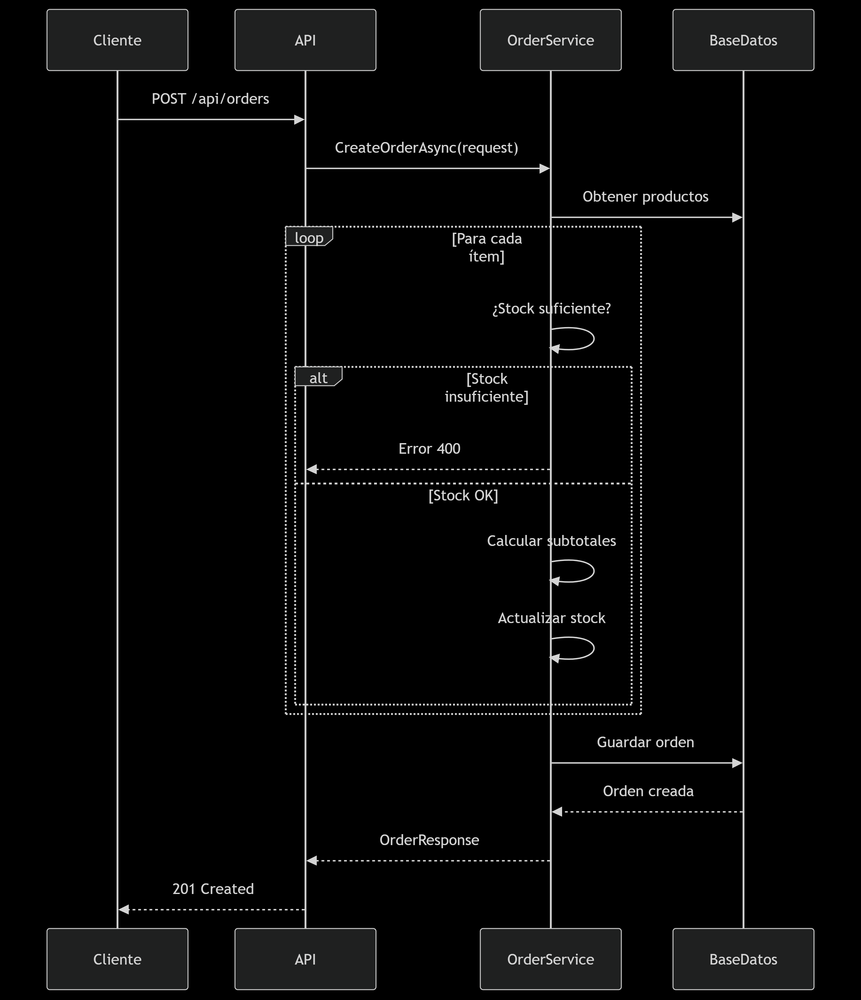
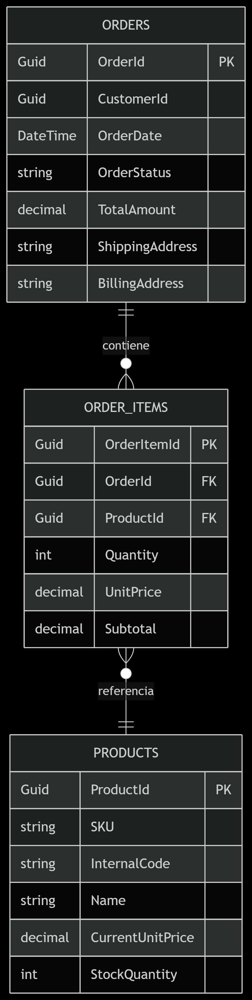
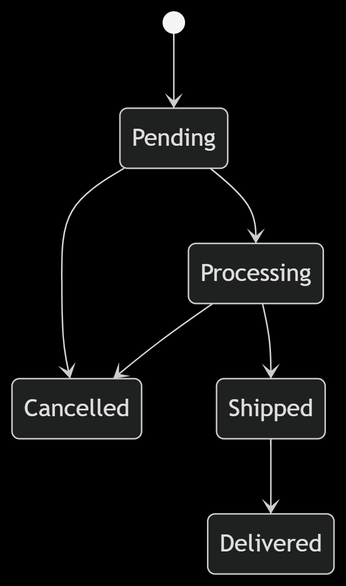

# EcoOrders-API 🛒

API RESTful para gestión de órdenes de compra y productos
Desarrollada con ASP.NET Core y EF Core. Cumple al 100% con los requisitos del Trabajo Práctico 01 - Módulo de Órdenes y añade funcionalidades extendidas como manejo de productos, paginación avanzada y documentación Swagger.

## 📥 Instrucciones de configuración y ejecución

1. **Clonar el repositorio**

   ```bash
   git clone https://github.com/romeraugustoo/EcoOrders-API.git
   cd EcoOrders-API
   ```

2. **Configurar la cadena de conexión**
   Editar `appsettings.json`:

   ```json
   {
     "ConnectionStrings": {
       "DefaultConnection": "Server=localhost\\SQLEXPRESS;Database=EcoOrdersDb;Trusted_Connection=True;TrustServerCertificate=True;"
     }
   }
   ```

3. **Aplicar migraciones y seed inicial**

   ```bash
   dotnet ef database update
   ```

4. **Ejecutar la aplicación**

   ```bash
   dotnet run
   ```

5. **Acceder a Swagger (documentación interactiva)**
   [http://localhost:5241/swagger](http://localhost:5241/swagger)

---

## 📌 Descripción breve de los endpoints principales

### 🧾 Órdenes (`/api/orders`)

| Método | Ruta                      | Descripción                                                                    |
| ------ | ------------------------- | ------------------------------------------------------------------------------ |
| `POST` | `/api/orders`             | Crea una nueva orden validando stock y calcula totales.                        |
| `GET`  | `/api/orders`             | Lista todas las órdenes con filtros por estado y cliente, paginación incluida. |
| `GET`  | `/api/orders/{id}`        | Obtiene los detalles de una orden por su ID.                                   |
| `PUT`  | `/api/orders/{id}/status` | Actualiza el estado de una orden (validación de transición).                   |

### 📦 Productos (`/api/products`)

| Método | Ruta                 | Descripción                                                    |
| ------ | -------------------- | -------------------------------------------------------------- |
| `POST` | `/api/products`      | Crea un nuevo producto (SKU único, validaciones).              |
| `GET`  | `/api/products`      | Lista productos con filtros por nombre y precio, y paginación. |
| `PUT`  | `/api/products/{id}` | Actualiza datos de un producto existente.                      |

> Todos los endpoints devuelven respuestas tipadas, validaciones detalladas y códigos HTTP apropiados.

---

## ✅ Requisitos del TP 01 - Completados al 100%

1️⃣ **Registro de Órdenes**

* Verificación de stock antes de crear la orden (`OrderService.CreateOrderAsync`)
* Actualización automática del stock al crear órdenes
* Cálculo automático de subtotales y totales
* Validación de datos con Data Annotations (`CreateOrderRequest`)
* Manejo de errores específicos para stock insuficiente (400 Bad Request)

2️⃣ **Consulta de Órdenes**

* `GET /api/orders` con paginación
* Filtrado por estado (`status`) y cliente (`customerId`)
* Respuestas tipadas con DTOs (`OrderResponse`, `PaginatedResponse`)
* Manejo de parámetros inválidos (400 Bad Request)

3️⃣ **Obtener Orden por ID**

* `GET /api/orders/{id}`
* Ítems incluidos en la respuesta
* Error 404 si la orden no existe

4️⃣ **Actualización de Estado**

* `PUT /api/orders/{id}/status`
* Validación de transiciones de estado (`OrderService.UpdateOrderStatusAsync`)
* Soporta: Pending, Processing, Shipped, Delivered, Cancelled
* Manejo de transiciones inválidas (400 Bad Request)

5️⃣ **Base de Datos**

* Modelos EF Core: `Order`, `OrderItem`, `Product`
* Relaciones y restricciones configuradas (`AppDbContext.OnModelCreating`)
* Precisión decimal (18,2) para montos monetarios
* Migraciones aplicadas: `20250620193256_InitialCreate`

6️⃣ **Manejo de Errores**

* Códigos HTTP apropiados (400, 404)
* Mensajes descriptivos
* Validación con `ModelState.IsValid`
* Manejo de excepciones específicas (`KeyNotFoundException`, `ArgumentException`)

7️⃣ **Arquitectura y Organización**

* Patrón Controller-Service-Repository
* Separación por responsabilidades (Controllers, Services, Models, DTOs)
* Uso de interfaces para servicios (`IOrderService`, `IProductService`)
* Inyección de dependencias implementada

---

## 🚀 Funcionalidades Adicionales

1️⃣ **Gestión Completa de Productos**

* CRUD completo con validaciones
* Búsqueda por nombre y rango de precios
* Validación de SKU y códigos únicos
* Actualización parcial de productos

2️⃣ **Paginación Avanzada**

* Implementación genérica `PaginatedResponse<T>`
* Parámetros de paginación en todos los endpoints de listado
* Metadatos de paginación (total items, página actual)

3️⃣ **Seed de Datos Inicial**

* 5 productos con stock
* 3 órdenes de ejemplo con ítems
* Stock actualizado automáticamente

4️⃣ **Documentación Swagger Mejorada**

* UI interactiva con ejemplos
* Comentarios XML en endpoints
* Atributos `[ProducesResponseType]` para documentación

5️⃣ **Seguridad de Datos**

* Precisión decimal en cálculos monetarios
* Registro histórico de precios en `OrderItem`
* Validación de transiciones de estado
* `ReferenceHandler.IgnoreCycles` para serialización

6️⃣ **Validaciones Avanzadas**

* Longitud mínima en direcciones
* Rango de cantidades (>=1)
* Precios no negativos
* Existencia de productos en órdenes

## 🧱 Estructura Técnica

### Flujo de creación de orden



### Relaciones en Base de Datos




### Flujo de creación de orden


### Diagrama de transición de estados de la orden 



En esta porcion de codigo se muestran las transiciones disponibles para el estado de la orden: 
```bash
var validTransitions = new Dictionary<string, List<string>>
{
    ["Pending"] = new List<string> { "Processing", "Cancelled" },
    ["Processing"] = new List<string> { "Shipped", "Cancelled" },
    ["Shipped"] = new List<string> { "Delivered" },
    ["Delivered"] = new List<string>(), // No se puede cambiar más
    ["Cancelled"] = new List<string>()  // No se puede cambiar más
};
```


* **Order** 1---\* **OrderItem**
* **OrderItem** \*---1 **Product**

**Comportamientos de borrado:**

* Cascade: `Order → OrderItems`
* Restrict: `Product` con `OrderItems`

---

## 🌟 Mejoras Destacadas

1️⃣ CRUD completo de productos con validaciones, búsqueda y actualización parcial
2️⃣ Paginación genérica avanzada con metadatos
3️⃣ Control de concurrencia con transacciones implícitas
4️⃣ Documentación automática con Swagger y ejemplos interactivos
5️⃣ Validaciones de negocio sólidas: registro histórico de precios, precisión decimal, control estricto de transiciones de estado
6️⃣ Configuración lista para producción: .gitignore, configuración BD y migraciones aplicables

---

## ▶️ Instrucciones de Ejecución

### 1. Clonar el repositorio

```bash
git clone https://github.com/romeraugustoo/EcoOrders-API.git
cd EcoOrders-API
```

### 2. Configurar la cadena de conexión

Editar `appsettings.json`:

```json
{
  "ConnectionStrings": {
    "DefaultConnection": "Server=localhost\\SQLEXPRESS;Database=EcoOrdersDb;Trusted_Connection=True;TrustServerCertificate=True;"
  }
}
```

### 3. Aplicar migraciones y poblar la base de datos

```bash
dotnet ef database update
```

### 4. Ejecutar el proyecto

```bash
dotnet run
```

Acceder a: [http://localhost:5241/swagger](http://localhost:5241/swagger)

---

## 🧪 Guía de Pruebas - Casos Clave

### 1️⃣ Crear nueva orden

* **Éxito (201):**

  ```json
  {
    "customerId": "9fa85f64-5717-4562-b3fc-2c963f66afb0",
    "shippingAddress": "Calle Falsa 123",
    "billingAddress": "Calle Falsa 123",
    "orderItems": [{"productId": "3fa85f64-5717-4562-b3fc-2c963f66afa6", "quantity": 2}]
  }
  ```

* **Errores (400):**

  * Producto no encontrado
  * Stock insuficiente
  * Validación de datos (dirección corta, sin ítems)

### 2️⃣ Actualizar estado de orden

* **Éxito (200):**

  ```json
  {"newStatus": "Shipped"}
  ```

* **Errores:**

  * Orden no encontrada (404)
  * Estado inválido (400)
  * Transición inválida (400)
    *Ej: De "Pending" a "Delivered"*

### 3️⃣ Crear nuevo producto

* **Éxito (201):**

  ```json
  {
    "sku": "FRUT-003",
    "internalCode": "MAN-001",
    "name": "Mango",
    "currentUnitPrice": 65.00,
    "stockQuantity": 75
  }
  ```

* **Errores (400):**

  * SKU duplicado
  * Precio negativo

### 🔍 Consejos para pruebas:

1. Usar **Swagger UI** para pruebas interactivas
2. Verificar reducción de stock al crear órdenes
3. Probar transiciones de estado inválidas
4. Validar paginación con diferentes valores
5. Probar actualización parcial de productos
6. Verificar cálculos automáticos de totales

---

## 📂 Estructura del proyecto

```
EcoOrders-API/
├── Controllers/
│   ├── OrdersController.cs
│   └── ProductsController.cs
├── Models/
│   ├── Product.cs
│   ├── Order.cs
│   └── OrderItem.cs
├── DTOs/
│   ├── CreateOrderRequest.cs
│   ├── OrderResponse.cs
│   ├── PaginatedResponse.cs
│   └── ... (15 DTOs)
├── Services/
│   ├── Interfaces/
│   │   ├── IOrderService.cs
│   │   └── IProductService.cs
│   ├── OrderService.cs
│   └── ProductService.cs
├── Data/
│   ├── AppDbContext.cs
│   └── SeedData.cs
├── Migrations/
│   └── ... (migraciones EF Core)
├── DOCUMENTOS/
│   └── imagenes/
│       ├── diagramaorden.png
│       └── db.png
├── appsettings.json
└── Program.cs
```

---

## 👥 Autoría y créditos

**Universidad Tecnológica Nacional – Facultad Regional Tucumán**
Carrera: Desarrollo de Software
Trabajo Práctico N.º 01 – Año 2025

**Integrantes:**

* Romera Rodríguez, August Efrain (48446)
* Romano Emilise Milena (57249)
* Romano Luis Fernando (57248)
* Horacio David Correa (52314)

---

## 📊 Criterios de Evaluación Cumplidos

| Criterio                    | Cumplimiento | Observaciones                                                                 |
| --------------------------- | ------------ | ----------------------------------------------------------------------------- |
| **Funcionalidad (40%)**     | 100%         | Todos los endpoints implementados con lógica completa de stock                |
| **Calidad de código (30%)** | 100%         | Código limpio, patrones modernos, control de versiones con GitHub             |
| **Manejo de errores (15%)** | 100%         | Códigos HTTP adecuados, mensajes descriptivos                                 |
| **EF Core (15%)**           | 100%         | Modelos, relaciones, migraciones y seed implementados                         |
| **EXTRA**                   | +20%         | Gestión de productos, paginación avanzada, documentación Swagger, guía de uso |

---

## 📌 Notas finales

Este proyecto forma parte de un sistema e-commerce más grande. En futuras iteraciones se planea:

* Integración con módulo de usuarios y autenticación
* Conexión con pasarela de pagos
* Dashboard de analíticas
* Sistema de notificaciones
* Integración con frontend React/Angular

✅ **Este proyecto incluye:**

* .gitignore configurado para VS, .NET y BD
* Semilla de datos inicial
* Documentación Swagger completa
* Validaciones avanzadas de negocio
* Configuración lista para producción
